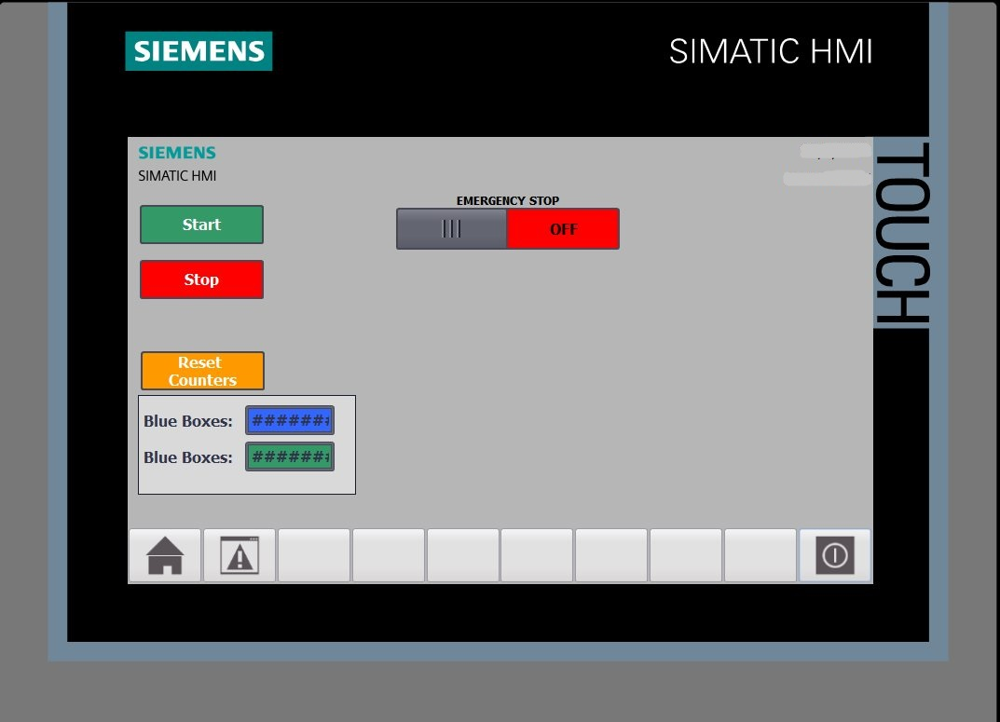

# -PLC- TAGGING BASED ON COLOR 

**Tagging Based On Color** is a PLC based industrial application for tagging products based on their color (blue or green).Tia portal V15 has been used for the programing.
Factory i/o has been used for the 3D simulation. S7-PLCSIM has been used instead of a real PLC.

## Main Idea

The boxes are on the `belt conveyor` where a `vision sensor` recognizes the color of the box. If the box is Green a `Pneumatic pusher` pushes the box to the second conveyor (if the box is blue it will continue on the same conveyor).
Then a `Two-Axis Pick & Place device` is used to simulate a `tag device`. In the end of The conveyors the boxes are counted with the help of two `Diffuse photoelectric sensors`.  
Next to The Station is an `Electric Switchboard` with two `Push Buttons` (start and stop) and a `two position red trigger action push button` used for emergency stop, this way you can have the basic control of the station without the `HMI screen`.
Also you can use the `HMI screen` to Start, Stop and emergency stop the station. In addition on the `HMI screen` you can supervise the counting of the boxes or reset the counters.

## Devices

- **PLC**:  `S7-1200`,

    **CPU**: `1211C DC/DC/DC`,

    **Description** : Work memory 50 KB; 24VDC power supply with DI6 x 24VDC SINK/ SOURCE, DQ4 x 24VDC and AI2 on
board;3 high-speed counters (expandable with digital signal board) and 4 pulse outputs on board; signal board expands on-board I/O; up to 3 communication modules for serial communication; 0.04 ms/1000 instructions; PROFINET interface for programming, HMI and PLC to PLC communication

- **HMI**: `TP700 Comfort`

## IMAGES

**FACTORY IO IMAGE**

**HMI IMAGE**

## Files

- **Ετικετες/Tags PLC code.pdf** : it's the plc code
- **Ετικετες/Tags ΗΜΙ screen.pdf** : it's the HMI settings
- **Ετικετες/Tags video.mkv** : it's a demonstration of how it works
